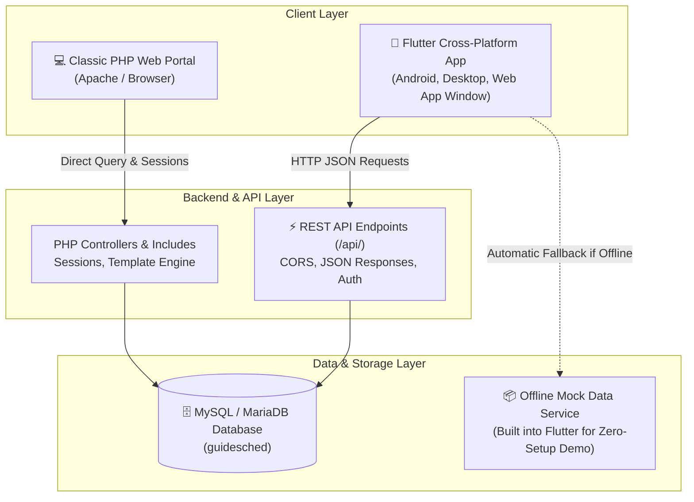
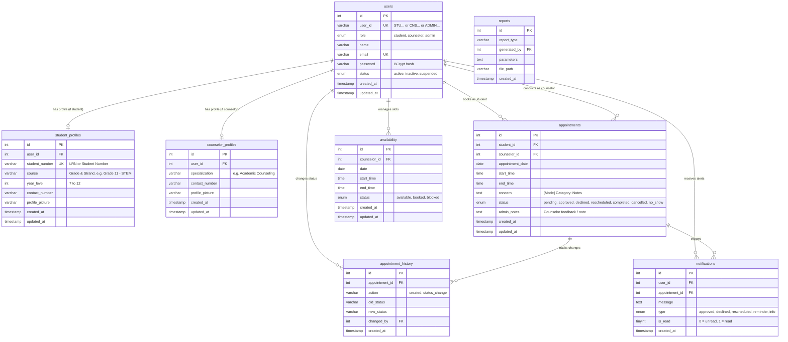

# GuideSched — Guidance Counseling Appointment & Scheduling System

[](https://flutter.dev)
[](https://dart.dev)
[](https://php.net)
[](https://mysql.com)
[](https://flutter.dev)
[](#license)

**GuideSched** is a complete, modern guidance counseling appointment and scheduling platform designed for **Cagasat High School**. It features a unified **2-User Role System (Student & Guidance Counselor)**, available as both a **Full-Featured PHP Web Portal** and a cross-platform **Flutter Mobile & Desktop Application** with a calming **Emerald & Forest Green design system**.

---

## 📑 Table of Contents
1. [System Architecture](#-system-architecture)
2. [Emerald & Forest Green Design System](#-emerald--forest-green-design-system)
3. [User Roles & Key Features](#-user-roles--key-features)
4. [In-Depth Database Documentation](#-in-depth-database-documentation)
5. [REST API Documentation (`/api/`)](#-rest-api-documentation-api)
6. [How to Run the Application](#-how-to-run-the-application)
7. [Default Test Accounts](#-default-test-accounts)
8. [Security & Data Integrity](#-security--data-integrity)
9. [Project Directory Structure](#-project-directory-structure)

---

## 🏛 System Architecture

The GuideSched ecosystem integrates three distinct layers that share a single MySQL database:



1. **Flutter Mobile & Web App (`guidesched_app/`)**: Responsive client written in Flutter 3.47 and Dart 3.13, utilizing Provider state management and Material 3 design with an Emerald Green theme.
2. **PHP REST API (`api/`)**: Lightweight JSON endpoints supporting CORS, allowing mobile, desktop, or web clients to query and mutate appointments, availability, notifications, analytics, and user sessions.
3. **MySQL Database (`guidesched`)**: Relational database storing user credentials, academic profiles, appointments, real-time availability slots, audit trails, and notification queues.
4. **Offline Demo Mode**: The Flutter app features an automatic fallback to an in-memory mock service so all screens, booking flows, and charts can be demonstrated even when XAMPP/MySQL is offline.

---

## 🌿 Emerald & Forest Green Design System

The system uses an **Emerald & Forest Green Palette**, crafted specifically for a high school counseling environment to convey mental clarity, growth, trust, and confidentiality:

| Token / Usage | Hex Code | Purpose / UI Element |
| :--- | :--- | :--- |
| **Primary Emerald** | `#059669` | Main buttons, active navigation items, primary branding |
| **Emerald Light** | `#10B981` | Accent highlights, gradients, selected states |
| **Deep Forest Green** | `#064E3B` | High-contrast headings, gradient headers, text emphasis |
| **Mint Container** | `#ECFDF5` / `#D1FAE5` | Stat card backgrounds, selected slot chips, date badges |
| **Surface Mint** | `#F0FDF4` | Subtle card background tints |
| **Pending Status** | `#D97706` (BG: `#FEF3C7`) | Amber pill badge for pending approval |
| **Approved / Completed** | `#059669` (BG: `#D1FAE5`) | Emerald pill badge for confirmed & attended sessions |
| **Declined / Cancelled** | `#DC2626` (BG: `#FEE2E2`) | Red pill badge for cancellations & declines |
| **Rescheduled Status** | `#2563EB` (BG: `#DBEAFE`) | Blue pill badge for moved sessions |

---

## 👥 User Roles & Key Features

### 🎓 Student Portal
- **Dashboard**:
  - Greeting banner with student initials and grade level.
  - **Daily Mental Wellness & 3-Month Consistency Streak** tracker.
  - **Next Upcoming Session** card with countdown, counselor name, and quick cancellation option.
  - One-tap **"Schedule an Appointment"** action card.
- **Interactive Booking Flow**:
  1. **Counselor Selector**: Choose from available guidance counselors with visible specializations.
  2. **Calendar Date Picker**: Interactive calendar with 60-day advance booking window.
  3. **Visual Time Slot Grid**: Real-time morning and afternoon slots marked as open (green) or booked (gray).
  4. **Consultation Mode**: Toggle between **Face-to-face** (Room 204) and **Online** (Google Meet).
  5. **Concern Categories**: Quick chips (*Academic stress, Anxiety, Family concerns, Peer relationships, Career & Strand guidance, Personal growth*).
  6. **Notes & Review**: Optional notes field and bottom sheet confirmation review.
- **My Sessions**:
  - Filter by **Upcoming**, **Past Sessions**, and **All**.
  - Search bar to filter by counselor, date, or concern topic.
  - Cancel pending bookings with an optional student reason note.
- **My Insights & Analytics**:
  - Metrics for Total Sessions Attended, Current Streak, and Top Concern Topic.
  - Monthly session volume bar graph.
  - Concern distribution progress bars.
- **Official Appointment & Consultation Pass**:
  - One-tap access to **Official Guidance Pass / Slip** formatted for Cagasat National High School.
  - Printable and downloadable as PDF directly in-browser.
  - Features student details, reference code (`#GS-CNHS-XXXXX`), schedule timestamps, counselor remarks, dual signature lines, and official DepEd / RA 9258 confidentiality notices.
- **Real-Time Notifications & Sound Effects**:
  - In-app chime and haptic feedback on booking confirmation, status updates, and session completion.
  - Instant alerts when appointments are approved, declined, or rescheduled.
  - Unread badge counters and "Mark all as read" capability.
- **Student Profile**:
  - Academic records (LRN, Grade Level, Strand, Contact Number, School Email).
  - Change password dialog and sign out.

---

### 🏛️ Counselor / Admin Portal
- **Counselor Dashboard**:
  - 4 interactive statistic cards: *Today's Appointments, Pending Requests, Approved Sessions, and No-Show Rate*.
  - **Today's Agenda**: Schedule of student consultations for the current day.
  - **Quick Action Approvals**: 1-click **Approve** or **Decline** with custom counselor notes sent to the student.
- **Appointment Management & Filter Chips**:
  - Tabbed overview: *Pending*, *Approved*, and *All Sessions*.
  - **Quick Status Filter Chips**: Filter sessions seamlessly by `All`, `Approved`, `Completed`, `Pending`, and `Cancelled`.
  - Search by student name, LRN, or concern details.
  - Mark sessions as **Completed** or **No Show**.
- **Clinical & Guidance Notes Editor**:
  - Open a dedicated notes dialog on any session anytime (not just at approval).
  - Pre-populated quick guidance templates (*Follow-up scheduled, Academic consultation completed, Teacher referral advised*).
  - Saves directly to the MySQL database and notifies the student immediately.
- **Official Guidance Pass Generator**:
  - View and print official consultation passes for students to excuse classroom attendance.
- **Schedule Management**:
  - Date selector to view counselor schedule.
  - Create custom availability time slots.
  - Toggle slots between Open for Booking and Blocked.
- **Students Directory**:
  - Searchable roster of students with LRN, Grade/Strand, and total sessions attended.
  - Bottom sheet inspection of student counseling history.
- **Analytics & Reporting**:
  - Monthly trend bar charts showing counseling volume across the school year.
  - Common concern topic breakdown (Academic, Anxiety, Family, Career).
  - Status breakdown distribution.
- **Counselor Profile & API Config**:
  - Specialization, office room (Room 204), and office hours.
  - Dynamic API URL configuration for network testing.

---

## 🗄️ In-Depth Database Documentation

The system runs on the **`guidesched`** database in MySQL / MariaDB (InnoDB engine, `utf8mb4_unicode_ci` character set).

### Entity-Relationship Diagram



---

### Detailed Table Specifications

#### 1. `users` Table
Stores all user accounts across both roles.
- **`id`** (`int(11)`, Primary Key, Auto Increment): Internal database ID.
- **`user_id`** (`varchar(50)`, Unique): System identifier (e.g. `STU758065` for students, `COUNSELOR001` or `CNS1087` for counselors, `ADMIN001` for administrators).
- **`role`** (`enum('student','counselor','admin')`): Role determining portal access and permissions.
- **`name`** (`varchar(100)`): Full legal name of the student or counselor.
- **`email`** (`varchar(100)`, Unique): Login credential and notification target.
- **`password`** (`varchar(255)`): Password hashed using PHP's `password_hash($pass, PASSWORD_BCRYPT)`.
- **`status`** (`enum('active','inactive','suspended')`, Default: `'active'`): Account operational state.
- **`created_at`** & **`updated_at`**: Automatic MariaDB timestamps.

#### 2. `student_profiles` Table
Stores high school academic and contact information for students.
- **`id`** (`int(11)`, Primary Key, Auto Increment)
- **`user_id`** (`int(11)`, Foreign Key `users.id`): References the student's primary user account.
- **`student_number`** (`varchar(20)`, Unique): Learner Reference Number (LRN) or official student ID.
- **`course`** (`varchar(100)`): Grade level and Senior High strand (e.g., `Grade 11 - STEM`, `Grade 12 - HUMSS`, `Grade 11 - ABM`, `Grade 12 - TVL`, `Grade 10 (Junior High)`).
- **`year_level`** (`int(11)`): Numeric year (7 to 12).
- **`contact_number`** (`varchar(20)`): Active mobile contact number for SMS or follow-up.
- **`profile_picture`** (`varchar(255)`, Nullable): Path to uploaded avatar image.

#### 3. `counselor_profiles` Table
Stores professional details for guidance counselors.
- **`id`** (`int(11)`, Primary Key, Auto Increment)
- **`user_id`** (`int(11)`, Foreign Key `users.id`): References the counselor's user account.
- **`specialization`** (`varchar(100)`): Primary counseling focus (e.g. *Academic Counseling, Behavioral & Emotional Wellness, Career & Strand Guidance*).
- **`contact_number`** (`varchar(20)`): Office or mobile phone number.
- **`profile_picture`** (`varchar(255)`, Nullable): Path to counselor photo.

#### 4. `appointments` Table
The central transactional table recording all counseling appointments.
- **`id`** (`int(11)`, Primary Key, Auto Increment)
- **`student_id`** (`int(11)`, Foreign Key `users.id`): ID of the student who booked.
- **`counselor_id`** (`int(11)`, Foreign Key `users.id`): ID of the assigned counselor.
- **`appointment_date`** (`date`): Scheduled date (`YYYY-MM-DD`).
- **`start_time`** (`time`): Slot start time (e.g. `10:00:00`).
- **`end_time`** (`time`): Slot end time (e.g. `11:00:00`).
- **`concern`** (`text`): Formatted string containing consultation mode, topic category, and optional notes:  
  *Format*: `[Mode] Category: Additional Notes`  
  *Example*: `[Face-to-face] Academic stress: Need assistance with midterm exam preparation`
- **`status`** (`enum`):
  - `'pending'`: Initial request submitted by student, awaiting counselor review.
  - `'approved'`: Confirmed by counselor.
  - `'declined'`: Declined by counselor with explanation note.
  - `'rescheduled'`: Date or time slot moved.
  - `'completed'`: Student attended session.
  - `'cancelled'`: Cancelled by student prior to session.
  - `'no_show'`: Student did not attend confirmed session.
- **`admin_notes`** (`text`, Nullable): Counselor's feedback, room instructions, or decline reason visible to the student.

#### 5. `availability` Table
Stores custom counselor working hours and override slots.
- **`id`** (`int(11)`, Primary Key, Auto Increment)
- **`counselor_id`** (`int(11)`, Foreign Key `users.id`): Counselor who owns the slot.
- **`date`** (`date`): The calendar date.
- **`start_time`** & **`end_time`** (`time`): Window of availability.
- **`status`** (`enum('available','booked','blocked')`):
  - `'available'`: Open for students to select.
  - `'booked'`: Linked to an active appointment.
  - `'blocked'`: Marked unavailable by counselor for meetings or breaks.

#### 6. `notifications` Table
Stores real-time in-app alerts for students and counselors.
- **`id`** (`int(11)`, Primary Key, Auto Increment)
- **`user_id`** (`int(11)`, Foreign Key `users.id`): Recipient user ID.
- **`appointment_id`** (`int(11)`, Nullable, Foreign Key `appointments.id`): Related appointment.
- **`message`** (`text`): Notification text (e.g., *"Your appointment on Aug 28, 2026 at 10:00 AM has been approved."*).
- **`type`** (`enum('approved','declined','rescheduled','reminder','info')`): Determines icon and badge color in Flutter and Web UI.
- **`is_read`** (`tinyint(1)`, Default: `0`): `0` = unread (triggers red badge dot), `1` = read.

#### 7. `appointment_history` Table
Immutable audit trail tracking every lifecycle transition of an appointment.
- **`id`** (`int(11)`, Primary Key, Auto Increment)
- **`appointment_id`** (`int(11)`, Foreign Key `appointments.id`)
- **`action`** (`varchar(50)`): Action performed (e.g. `'created'`, `'status_change'`).
- **`old_status`** (`varchar(20)`, Nullable): Status prior to the change.
- **`new_status`** (`varchar(20)`): Status after the change.
- **`changed_by`** (`int(11)`, Foreign Key `users.id`): User who executed the action.
- **`created_at`** (`timestamp`): Timestamp of change.

---

## 🌐 REST API Documentation (`/api/`)

The REST API allows the Flutter app to communicate with the XAMPP PHP backend. All endpoints return standardized JSON:
```json
{
  "success": true,
  "message": "Operation description",
  "data": { ... }
}
```

| Endpoint | Method | Parameters | Description |
| :--- | :--- | :--- | :--- |
| `api/auth.php` | `POST` | `action=login`, `email`, `password` | Authenticates student or counselor and returns profile. |
| `api/auth.php` | `POST` | `action=register`, `name`, `email`, `password`, `student_number`, `course`, `year_level`, `contact_number` | Registers a new student account. |
| `api/auth.php` | `POST` | `action=change_password`, `user_id`, `current_password`, `new_password` | Updates account password. |
| `api/counselors.php` | `GET` | *(none)* | Returns list of all active guidance counselors with specializations. |
| `api/availability.php` | `GET` | `counselor_id`, `date` (`YYYY-MM-DD`) | Fetches time slot availability with open/booked status flags. |
| `api/availability.php` | `POST` | `counselor_id`, `date`, `start_time`, `end_time`, `status` | Adds or updates an availability slot. |
| `api/appointments.php` | `GET` | `user_id`, `role`, `status` (*optional*) | Returns appointment records joined with counselor and student profiles. |
| `api/appointments.php` | `POST` | `action=book`, `student_id`, `counselor_id`, `appointment_date`, `start_time`, `end_time`, `mode`, `concern_category`, `details` | Creates an appointment, notifies counselor, and logs audit trail. |
| `api/appointments.php` | `PUT` / `POST` | `id`, `action` (*approve / decline / complete / cancel / noshow / update_notes*), `changed_by`, `admin_notes` | Updates appointment status or modifies counselor clinical notes, notifying student. |
| `api/notifications.php` | `GET` | `user_id` | Returns notification list and unread count. |
| `api/notifications.php` | `POST` | `user_id`, `notification_id` or `mark_all=true` | Marks notifications as read. |
| `api/analytics.php` | `GET` | `user_id`, `role`, `year` | Returns session volume charts and concern category distributions. |
| `api/students.php` | `GET` | `search` (*optional*) | Searchable student directory with session counts. |

---

## 🚀 How to Run & Build the Application

### Option 1: 1-Click Standalone Desktop Window (Instant, No SDKs needed)

Launch GuideSched in a dedicated **desktop mobile app frame** (isolated phone dimensions, no address bar, no browser tabs):
1. Navigate to the project root folder:
   `c:\xampp\htdocs\APPOINTMENT IN GUIDANCE APP`
2. **Double-click** [`Launch_GuideSched_App.bat`](file:///c:/xampp/htdocs/APPOINTMENT%20IN%20GUIDANCE%20APP/Launch_GuideSched_App.bat).
3. *(Optional)* Click the **"Install GuideSched"** icon in the window title bar to install it as an actual Windows desktop app on your Start Menu and Taskbar!

---

### Option 2: Build an Installable Android APK (`.apk` for Phones)

You can compile a standalone release `.apk` file that installs directly onto any Android phone or tablet:

#### 1-Click Script:
Simply double-click **[`Build_Android_APK.bat`](file:///c:/xampp/htdocs/APPOINTMENT%20IN%20GUIDANCE%20APP/Build_Android_APK.bat)** in the root folder.
- Automatically checks for Java (JDK 17) and Android SDK.
- Offers automatic installation of missing tools via `winget`.
- Compiles `dist/GuideSched_v1.0.apk` and opens the output folder.

#### Manual Terminal Commands:
```powershell
# 1. Install Java JDK 17 (if not present)
winget install Microsoft.OpenJDK.17

# 2. Install Android Studio (for Android SDK)
winget install Google.AndroidStudio
# Launch Android Studio once to complete SDK setup, then ensure "Android SDK Command-line Tools" is installed

# 3. Configure Android SDK in Flutter
flutter config --android-sdk "$env:LOCALAPPDATA\Android\Sdk"
flutter doctor --android-licenses

# 4. Compile Release APK
cd "c:\xampp\htdocs\APPOINTMENT IN GUIDANCE APP\guidesched_app"
flutter build apk --release
# Generated APK: build/app/outputs/flutter-apk/app-release.apk
```

---

### Option 3: Compile Native Windows Desktop Executable (`.exe`)

You can compile a high-performance native Windows executable (`guidesched_app.exe`):

#### 1-Click Script:
Double-click **[`Build_Windows_App.bat`](file:///c:/xampp/htdocs/APPOINTMENT%20IN%20GUIDANCE%20APP/Build_Windows_App.bat)** in the root folder.
- Verifies Windows Developer Mode (opens Settings if needed).
- Verifies Visual Studio 2022 C++ build tools.
- Compiles `dist/windows_app/guidesched_app.exe`.

#### Manual Terminal Commands:
```powershell
# 1. Enable Windows 11 Developer Mode
start ms-settings:developers   # Toggle "Developer Mode" to ON

# 2. Install Visual Studio 2022 with C++ Workload
winget install Microsoft.VisualStudio.2022.Community --override "--add Microsoft.VisualStudio.Workload.VCTools --includeRecommended --passive"

# 3. Compile Native Windows Executable
cd "c:\xampp\htdocs\APPOINTMENT IN GUIDANCE APP\guidesched_app"
flutter build windows --release
# Generated EXE: build/windows/x64/runner/Release/guidesched_app.exe
```

---

### Option 4: Run via Flutter CLI (Development)

Ensure Flutter is in your active PowerShell session:
```powershell
$env:Path += ";C:\flutter\bin"
cd "c:\xampp\htdocs\APPOINTMENT IN GUIDANCE APP\guidesched_app"

# Fetch packages
flutter pub get

# Run in Chrome or Edge
flutter run -d chrome
flutter run -d edge

# Run on connected Android device via USB
flutter run -d android
```

---

### Option 4: Classic PHP Web Portal

1. Start **Apache** and **MySQL** in XAMPP Control Panel.
2. Open your browser:
   - **Student Portal**: [`http://localhost/APPOINTMENT%20IN%20GUIDANCE%20APP/student/dashboard.php`](http://localhost/APPOINTMENT%20IN%20GUIDANCE%20APP/student/dashboard.php)
   - **Counselor Portal**: [`http://localhost/APPOINTMENT%20IN%20GUIDANCE%20APP/admin/dashboard.php`](http://localhost/APPOINTMENT%20IN%20GUIDANCE%20APP/admin/dashboard.php)
   - **Login Page**: [`http://localhost/APPOINTMENT%20IN%20GUIDANCE%20APP/login.php`](http://localhost/APPOINTMENT%20IN%20GUIDANCE%20APP/login.php)

---

## 🔑 Default Test Accounts

After importing the database, use these default accounts (or click the **"Quick Demo Accounts"** button on the mobile login screen):

| User Role | Email | Password | Access Portal |
| :--- | :--- | :--- | :--- |
| **Guidance Counselor** | `maria.santos@guidesched.com` | `counselor123` | Counselor Portal / Admin Dashboard |
| **Student** | `juan.santos@cagasaths.edu.ph` | `student123` | Student Portal |
| **Student 2** | `aira@gmail.com` | `student123` | Student Portal |
| **System Administrator** | `admin@guidesched.com` | `admin123` | Admin Portal |

---

## 🔒 Security & Data Integrity

- **Password Hashing**: Passwords stored using standard PHP `password_hash()` with `PASSWORD_BCRYPT` (cost factor 10).
- **SQL Injection Defense**: All API queries and backend operations strictly use prepared parameterized statements (`$stmt->prepare()` and `$stmt->bind_param()`).
- **CORS Protection**: REST endpoints include configured `Access-Control-Allow-Origin`, `Methods`, and `Headers` for secure client-server communication.
- **Input Sanitization**: Strip tags and `htmlspecialchars()` applied on incoming form text.
- **Transactional Consistency**: Appointment creations and status updates use MySQL database transactions (`$conn->begin_transaction()`, `$conn->commit()`, `$conn->rollback()`) ensuring notifications, history entries, and appointment records stay in sync.

---

## 📁 Project Directory Structure

```
APPOINTMENT IN GUIDANCE APP/
├── Launch_GuideSched_App.bat         # 1-click launcher for mobile app window
├── README.md                          # Master documentation (this file)
├── guidesched.sql                     # Full MySQL database export
├── api/                               # REST API Endpoints (JSON backend)
│   ├── config.php                     # CORS & JSON helpers
│   ├── auth.php                       # Login, registration, password updates
│   ├── counselors.php                 # Active counselor listings
│   ├── availability.php               # Slot availability queries & creation
│   ├── appointments.php               # Booking, approvals, declines, cancels
│   ├── notifications.php              # Notifications & unread counts
│   ├── analytics.php                  # Volume trends & concern distributions
│   └── students.php                   # Student directory search
├── app/                               # Compiled production web bundle for Apache
├── guidesched_app/                    # Flutter Cross-Platform Project
│   ├── lib/
│   │   ├── main.dart                  # Entry point & role routing
│   │   ├── theme/app_theme.dart       # Emerald & Forest Green design system
│   │   ├── models/                    # Data models (User, Appointment, Slot, Notif, Analytics)
│   │   ├── services/                  # API client & MockDataService offline fallback
│   │   ├── providers/                 # State management (Auth, Appointment, Notif, Theme)
│   │   ├── widgets/                   # Custom green cards, badges, chips, banners
│   │   └── screens/
│   │       ├── auth/                  # Login, Register, Forgot Password
│   │       ├── student/               # Student Portal screens
│   │       └── counselor/             # Counselor Portal screens
│   ├── android/                       # Native Android project files
│   ├── windows/                       # Native Windows desktop project files
│   ├── web/                           # Web application wrapper & manifest
│   ├── pubspec.yaml                   # Flutter dependencies
│   └── README.md                      # Flutter app documentation
├── admin/                             # PHP Counselor Web Portal
├── student/                           # PHP Student Web Portal
├── includes/                          # PHP Shared Backend Functions
└── config/                            # Database & session configuration
```
